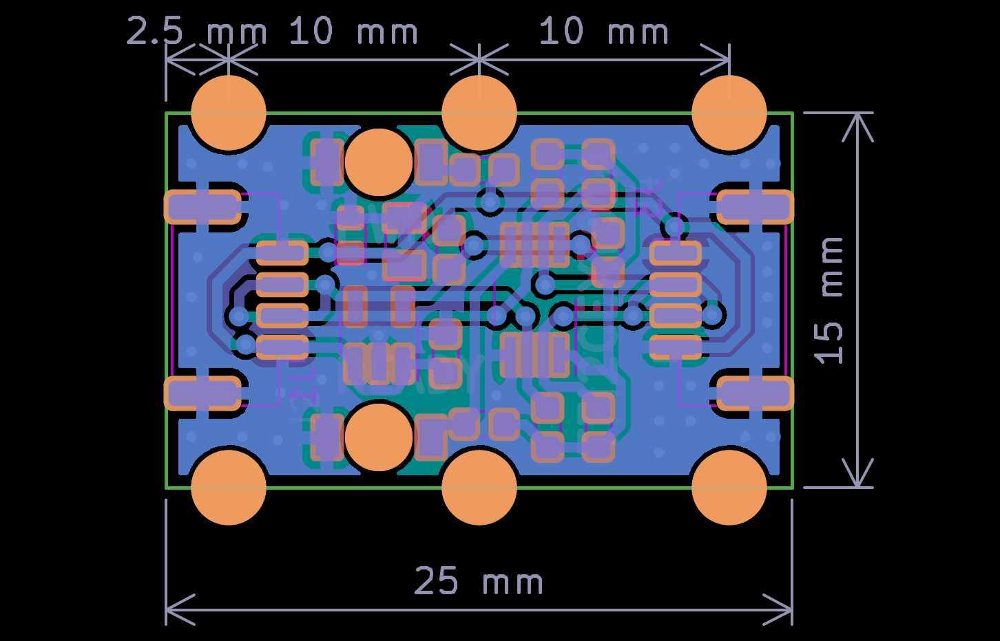

# TFI2C01A - I²C bus extender

I²C bus extension module. This module allows extension of total lenght of I2C bus on the UAV.

## Where to get it?

ThunderFly RPM counter is commercially available from [ThunderFly s.r.o.](https://www.thunderfly.cz/), write an email to info@thunderfly.cz

## Parameters

| Parameter | Value | Description |
|-----------|-------|-------------|
| Data rate | Up to 400 kHz | Limited by used [TCA4307 IC](https://www.ti.com/product/TCA4307) |
| I2C Connector | 2x 4-pin JST-GH | Connected in parallel |
| Operating and storage temperature | -20 - +40°C | Limited by case material |
| Operational input voltage | 3.6 - 5.4V |  |
| Mass | 2 g + 4 g | PCB + case |
| Dimensions | TBD | TBD |
| Weather resistance | TBD |  |

## Features

  * Input Power status LED indicator
  * Optionally possible to solder pass-trough I²C connectors to allow daisy chain of different sensors
  * Ability to isolate I2C bus segments by disconnecting frozen devices
  * Capability to handle differently the Master and a slave bus sides
  * The extender is capable to perform device reset in the case it seems to be frozen
  * READY signal indication of correct connection of both I2C bus sides.

The two I²C Pixhawk connectors on the bottom and top are connected directly to each other. This feature allows easily nesting with other I²C devices on to existing functional bus cabling.

### Device Reset

The TCA4307 has stuck bus recovery, which automatically disconnects the slave side of bus from master if it detects either SDAOUT or SCLOUT are low for about 40 ms. Once the bus is disconnected, the device automatically generates up to 16 pulses on SCLOUT to attempt to reset a device which is holding the whole bus low. 

### PCB dimensions

The PCB is designed to be mounted in the slit and fixed by screws on the sides. The supposed screw diameter is metric 3mm e.g. DIN 912 M3 Hexagon socket Head Cap Screws.
