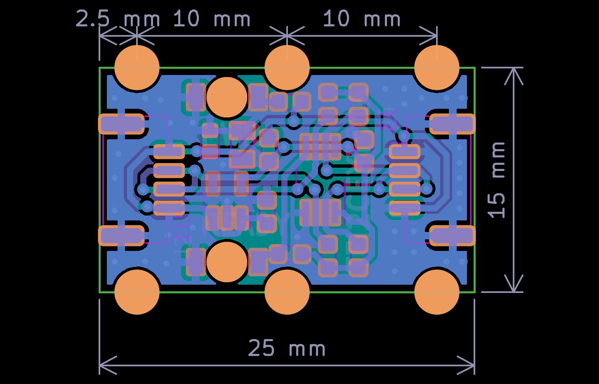

# TFI2CEXT01A - I²C bus extender

I²C bus extension module. This module allows an extension of the usable total length of the I2C bus on the UAV. Most I2C bus instances benefit from having TFI2CEXT positioned midway between master and slave, where its signal amplification is most effective in both directions.

In practice, I2C devices vary in driving capability, and I2C signals are often affected by capacitive load or unwanted signal coupling. TFI2CEXT can effectively isolate bus segments, ensuring devices only see the segment's wiring load up to the TFI2CEXT. Thus, placing TFI2CEXT closer to the "problematic" I²C device is optimal.

## Where to get it?

ThunderFly TFI2CEXT01A counter is commercially available from [ThunderFly s.r.o.](https://www.thunderfly.cz/), write an email to info@thunderfly.cz. Or shop it on [Tindie.](https://www.tindie.com/products/thunderfly/tfi2cext01-pixawk-i2c-bus-extender/)

## Parameters

| Parameter | Value | Description |
|-----------|-------|-------------|
| Data rate | Up to 400 kHz | Limited by used [TCA4307 IC](https://www.ti.com/product/TCA4307) |
| I2C Connector | 2x 4-pin JST-GH | Connected in parallel |
| Operating and storage temperature | -20 - +40°C | Limited by case material |
| Operational input voltage | 3.6 - 5.4V |  |
| Mass | ~2 g | PCB |
| Dimensions | 15x25x6(10.5) | One-sided connectors (With connector on both sides) |
| Weather resistance | IP00 |  |

## Features

  * Input Power status LED indicator
  * Optionally possible to solder pass-through I²C connectors to allow a daisy chain of different sensors
  * Ability to isolate I2C bus segments by disconnecting frozen devices
  * Capability to handle differently the Master and a slave bus sides
  * The extender can perform a device reset in case it seems frozen or unresponsive.
  * READY signal indication of the correct connection of both I2C bus sides.

The two I²C Pixhawk connectors on the bottom and top are connected directly. This feature allows easy nesting with other I²C devices onto existing functional bus cabling.

### Device Reset

The TCA4307 has a stuck bus recovery feature. It disconnects the slave side if SDAOUT or SCLOUT is low for about 40 ms, then generates up to 16 pulses on SCLOUT to reset the bus. The slave side reconnects only after the issue is resolved.

### PCB dimensions

The PCB is designed to be mounted in the slit and fixed by screws on the sides. The supposed screw diameter is metric 3mm e.g. DIN 912 M3 Hexagon socket Head Cap Screws.

## Documentation

The additional documentation is available on the [ThunderFly docs website](https://docs.thunderfly.cz/avionics/TFI2CEXT/). 

### Connection 

Due to the device reset capability of TFI2CEXT01 special attention should be dedicated to the proper connection of the module to the UAV. The connector closer to the LEDS should be connected to the Master (e.g. autopilot). The opposite connector at the far side from LEDs should be connected to I²C slaves, e.g. sensors. 

